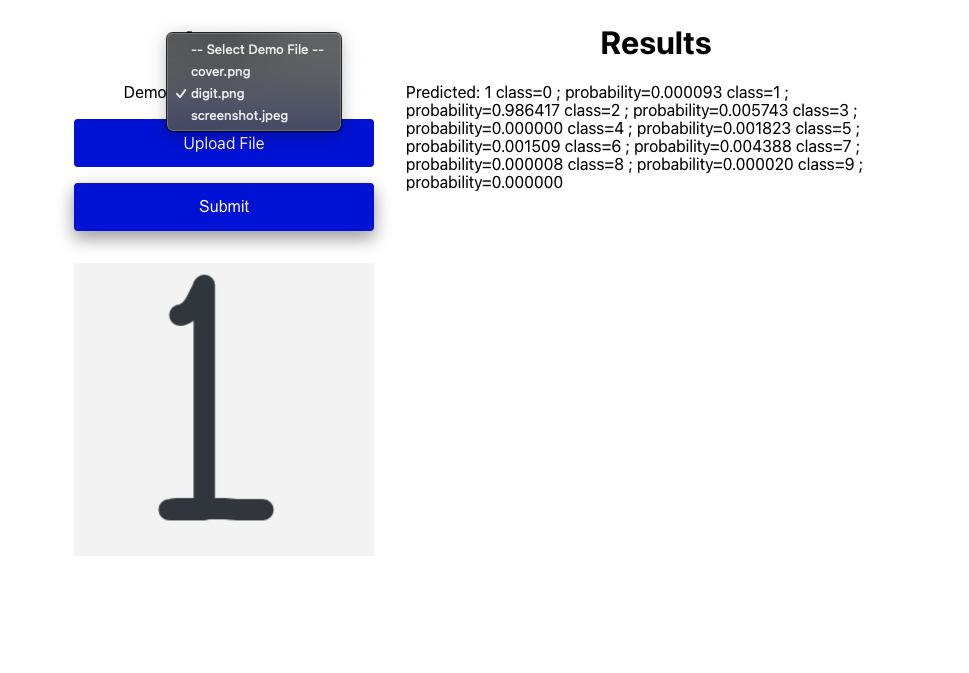

# EECS 605 Module 10

## Overview
Add a drop-down menu that allows users to select demo files from the specified S3 bucket for your ML model demo.

**NOTE: Reference https://gitlab.eecs.umich.edu/stevesl/eecs-605-module-6/-/tree/master/Module%206 since the steps are almost identical.**

## Why are we doing this?
1. We want to make sure whoever is trying out your demo to have demo files to use for initial testing and not have to create input data themselves just to try out the demo project.
2. We can change demo files without having to update any of the front-end code. You just have to add/remove files from the S3 bucket.

## Setup Lambda for GET/POST REST APIs
1. Deploy `lambda_function.py` in `lambda-api` to Lambda. This file is small enough that it can be copy and pasted into the Lambda directly.

## API Gateway setup for GET/POST REST APIs
1. Follow the exact steps described in https://gitlab.eecs.umich.edu/stevesl/eecs-605-module-6/-/tree/master/Module%206 for the POST REST API.
2. Follow the exact steps described in https://gitlab.eecs.umich.edu/stevesl/eecs-605-module-6/-/tree/master/Module%206 for setting up the POST REST API, but do them for GET REST API.

## Test your GET/POST REST APIs
* Setup: Fill in the TODOs with:
  1. The handwritten digit inference POST REST API - set it for `ML_API_ENDPOINT`.
  2. The demo files GET/POST REST API - set it for `DROPDOWN_API_ENDPOINT`.

Use the front-end code to test the APIs to see if it can:
1. Get the list of demo files from the S3 bucket.
2. Download the specified file from the S3 bucket.

## Implement this feature in your custom website
Read through the front-end code to understand which components are responsible for creating the drop-down menu and use and modify the necessary code that you need for your use-case - provided code is for handling image file specific.
